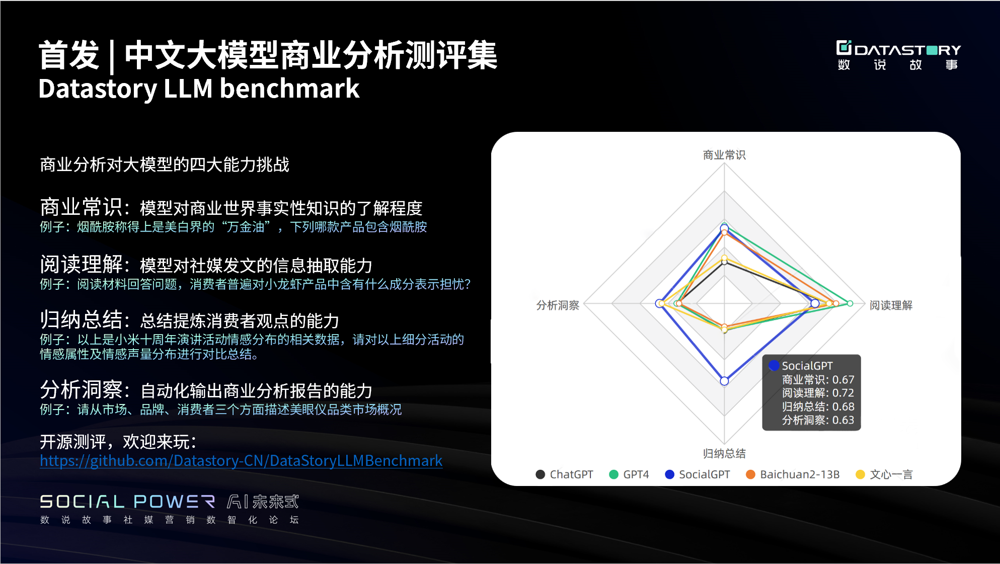

# 中文大模型商业分析测评集（Datastory LLM benchmark）

## 测评集
### 商业常识和阅读理解各200题（客观题）
[DatastoryLLMBenchmark_objective.csv](DatastoryLLMBenchmark_objective.csv)
### 归纳总结和分析洞察各50题（主观题）
正进行脱敏工作，即将推出

## 测评结果（2023年10月）
| 测评维度 | ChatGPT | GPT4 |SocialGPT|Baichuan2-13B| 文心一言 |
|:---:|:---:|:---:|:---:|:---:|:---:|
| 商业常识 | 0.55 | **0.68** | 0.67  | 0.65 | 0.56 |
| 阅读理解 | 0.77 | **0.85** | 0.72  | 0.80 | 0.77 |
| 归纳总结 | 0.50 | 0.49 |**0.68**| 0.48 | 0.49 |
| 分析洞察 | 0.57 | 0.57 |**0.63**| 0.56 | 0.62 |